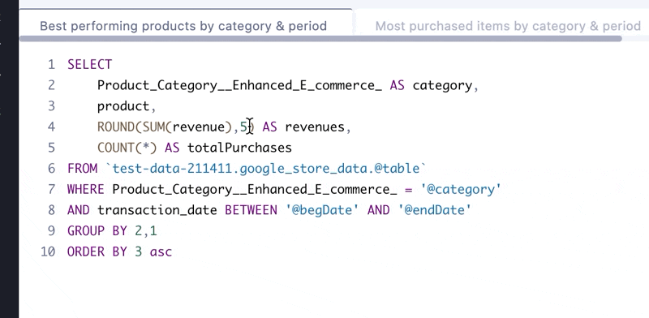
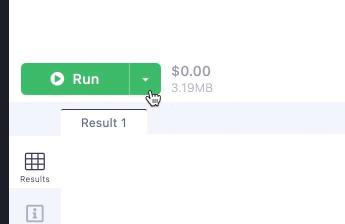

# Adding Commit Messages to your commits

Git commit messages give you and your team more context around the changes that were made, in superQuery's case, to your query.

Once you've connected your Github repo to superQuery, you can start committing queries to Github and add messages to them.

Let's see how this is all done in three easy steps.

### Step \#1: Make a change to your query

For your SQL to be committed to Github, a change needs to be made from the previously committed version of the query.

### Step \#2: Manually commit your SQL

By default, all queries are committed once your Github/BitBucket repo or GitLab project is connected. You can toggle the Auto Commit functionality off in your query settings if you'd prefer to manually commit.

To manually commit your SQL, click on the ⬇️ icon next to the "Run" button, and click "Commit"

### Step \#3: Add a commit message

Finally, write a message for your commit that succinctly explains the changes you made to your query from the last commit.

Once you write the message, click "Ok" to commit the changes and your message to your Github repo.

When opening your Git repo and going to the appropriate Board, you should see your commit message next to the query tab you modified:

