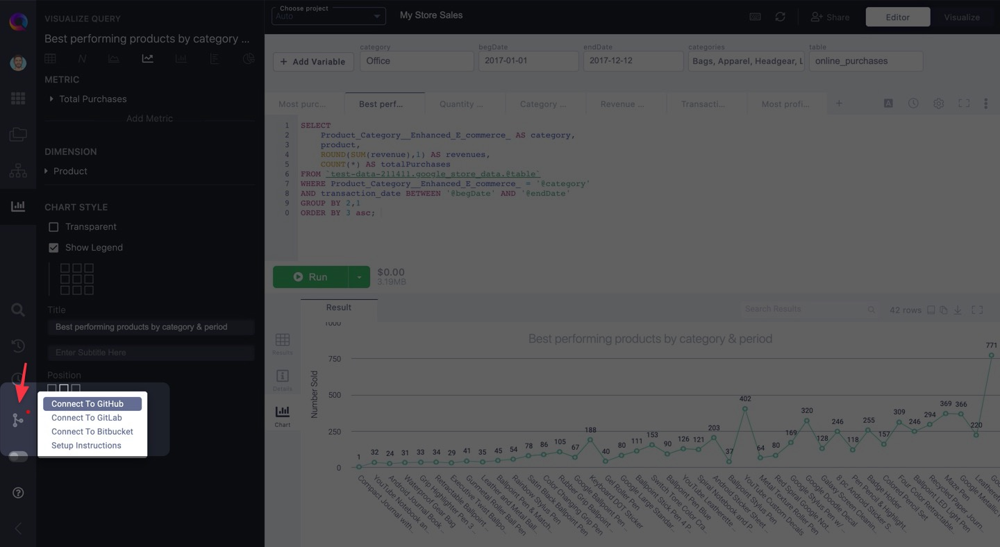

# Connecting your Github repo to superQuery


**Looking to connect superQuery to a repo in your Github Organization?** First make sure superQuery has the appropriate permissions in your GitHub Organization. Read [this post](connect-github-org.md) to see how.


Have you ever written what you thought was a one-time query, only to have to re-create it from memory a few weeks later? Or have you ever found yourself needing a previous version of a query you wrote?

By connecting your Github repository to superQuery, you'll effectively create a query library — a place for saving, updating, and tracking changes in your queries.

Let's see how to set this up below.

### Step 1: Open Source Control options in your Resource Panel

Click on the Source Control icon \(shown below\), and then select "Connect to Github".

### Step 2: Authorize superQuery to access your resources

You will temporarily be taken to Github to sign in \(if you're not already signed in\) and then give the superQuery Github app authorization to access resources.

This allows superQuery to display a list of repositories, from which you'll select the one that you can connect to.

### Step 3: Select the repository you want to connect

After granting authorization, you will be taken back to superQuery where you can now select the repo you want to connect.


Make sure your repository has **at least one file** inside _before_ connecting \(a README file works just fine\)


If you don't have a GitHub repository already, don't worry. You can set up a private one [**for free**](https://github.com/pricing). 

### Step 4 \[optional\]: Request permission to install the superQuery Github application

In cases where you want to connect to a repository you're not the owner of — such as a repository inside of your company's [GitHub Organization](https://help.github.com/en/articles/about-organizations) — you have to request permission from the repository owner.  
  
To request permission, [go here](https://github.com/apps/superQuery-io/installations/new).

Select your company's GitHub Organization to request access.

Then, determine whether you want to request permission for all repositories, or specific ones.

### Step \#5: View your changes in GitHub

In GitHub, your queries are organized in your project under a pre-determined hierarchy of User &gt; [Board](../superquery-editor/organizing-queries.md) &gt; [Query Tab](../superquery-editor/query-tabs.md).

To see your changes in GitHub, find your query by clicking on:

1. **superQuery**, then
2. Your superQuery **username** \(i.e. email address\), then
3. The **Board** the query is in, and finally
4. The name of the **query tab**, you made the changes in.

For example, in our case the path would be **superquery-queries** \[project\] &gt; **superQuery &gt; My Store Sales** \[Board name\] &gt; **Best performing products by category & period** \[tab name\].

Once arriving at the query tab you want to examine \(in our case below, "Most Profitable Days"\), you will see the last version committed to your GitHub project.

To view the history of changes and see what changes were made, click on "History"

You will be able to see your latest commits / changes made to that tab.

Finally, click on any of the messages to see the changes made in that commit.

