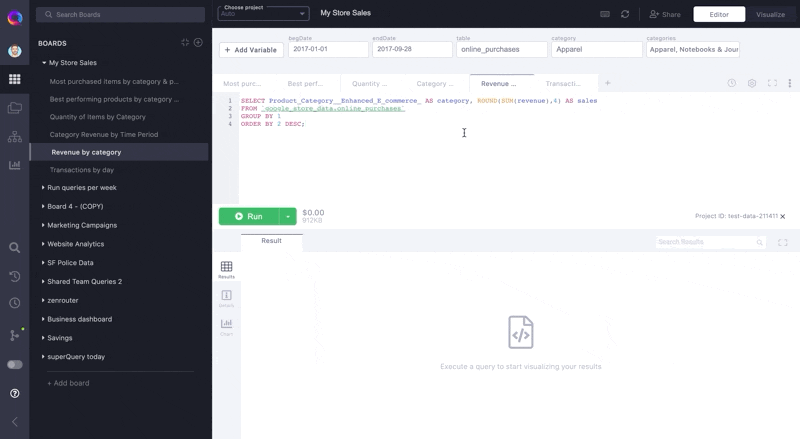
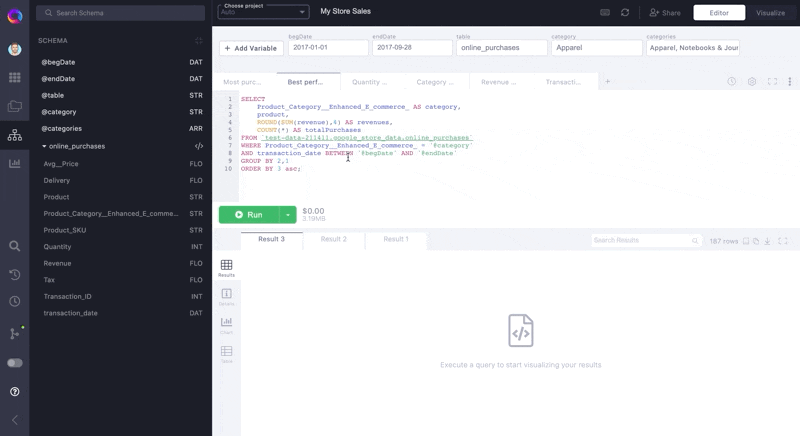
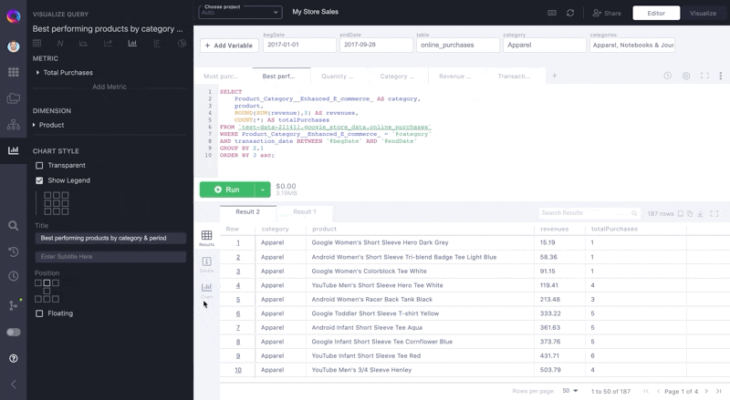
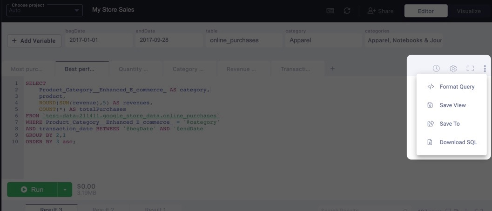

# Navigating superQuery

This post will cover the fundamental parts of the superQuery UI.

superQuery is broken down into five sections:

1. Resource Panel
2. SQL Editor
3. Results Grid
4. Visualize Toggle
5. Right pane

Let's briefly cover the main capabilities of each section.

### \#1 — Resource Panel 

The resource panel contains eight resources, each represented by a unique icon.

#### Boards

[Boards](../superquery-editor/organizing-queries.md) are like folders, where you can organize your queries by topic, theme, project. Think of them as a filing & management system for your queries.

#### Resources  

Access all of your BigQuery projects and resources for other supported services \(AWS Athena and DynamoDB\) here.  

#### Schema 

View columns of the table\(s\) being queried in your current query tab. 

[Schema](../superquery-editor/schema.md) is automatically detected based on the tables queried in your SQL.

  
**Query History**

Query history displays the previous queries you've executed in superQuery and BigQuery.

#### **Scheduled Queries** 

Manage and edit your [scheduled queries](../scheduled-queries/managing-scheduled-queries.md) here. 

#### 

#### Source Control

Connect your [GitHub repository](../git-integrations/connect-github.md) or [GitLab project](../git-integrations/connect-gitlab.md) to superQuery.

Once connected, it's easy to back up queries, catalogue them, and version-control them.

#### Dark Mode / Light Mode toggle

Toggle between Dark Mode and Light Mode with a single click.

#### 

#### superQuery Help

Clicking on this icon gives you several options:

1. Contact Support
2. Make a feature request
3. Open superQuery documentation
4. Access keyboard shortcuts
5. Open the latest release notes
6. Check out pricing

**Profile**

\*\*\*\*

* View and change your billing plan
* Connect your Google Cloud Storage bucket to save downloaded CSV results there.

### \#2 — SQL Editor

The SQL Editor is where you write your queries. In the editor, you have the following capabilities for analyzing data faster and more efficiently.

#### Query Tabs

Organize your queries into [tabs](../superquery-editor/query-tabs.md) that you can name & easily identify later. 

Tabs allow you to work across multiple queries in one window. The SQL persists across sessions, similar to how you work in a Google Doc — meaning you won't lose your work if you refresh the page or close your session.

With tabs, you can easily jump between queries you're working on.

#### Query Cost Calculator

Know your query's cost before executing it. Avoid costly mistakes and query with transparency.

#### Variables

[Variables](../superquery-editor/variables.md) are placeholders for values that can change. 

When you find yourself constantly updating a WHERE clause, then variables can be useful.  
  
They make your queries more readable and allow you to perform quick changes on your query without modifying the SQL itself.

#### Autocomplete

Write queries faster using SQL Autocomplete.

#### Share query tab

[Share a query tab](../superquery-editor/query-tabs.md#share-tab), or an [entire Board](../superquery-editor/organizing-queries.md#share-a-board), with your team.

#### Manually commit queries to Github or GitLab

Use [Manual Commit](../git-integrations/add-commit-messages.md) to add a message to your Git commits, or if you want to commit a change without running the query.

### \#3 — Results Grid

In your results grid, you can:

* View, explore, and export query results.
* [Generate a quick visualization](../superquery-editor/charts.md) of your query result.
* Preview tables and views and see their details.
* Make changes to views and [commit them to Git](../git-integrations/version-control-views.md)

### \#4 - Dashboard View

The **Visualize** toggle transforms the latest results of all of your query tabs into a [dashboard](../dashboards/create-dashboards.md) in one click — no exporting required.

### \#5 — Right Pane

Your right pane \(highlighted below\) is separated into the following features

* [Schedule Query](../scheduled-queries/schedule-query.md) - schedule your current tab's SQL to run at a regularly scheduled interval
* [Query Tab Settings](../superquery-editor/tab-settings.md) - modify settings for your query tab like billing project, destination table, and more
* Full-Screen Mode - expands your editor view
* A "More Options" button which opens
  * Format Query - formats your current tab's SQL
  * Save View - saves your current query as a view
  * Save To - saves your current query tab to a different board
  * Download SQL - downloads your current query tab's SQL into a .sql file

  

